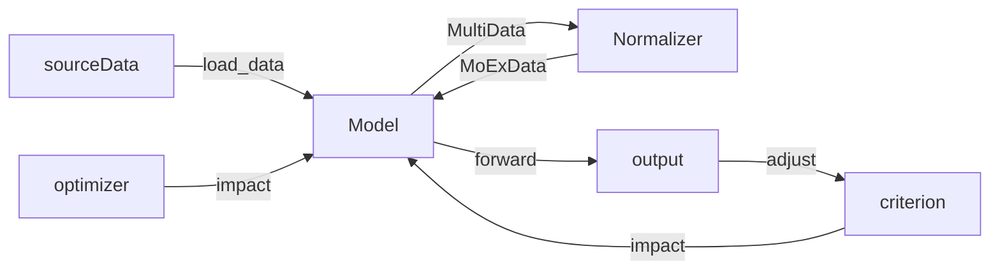

[toc]


## MoExDemo.py

#### 功能：

- 将副图片的矩特征混合到主图片上实现图像增扩


#### 模块：

- normalize(x)
  - x——图片Tensor流
  - 归一化返回，特征，一阶矩，二阶矩
- reverse_normalize(x, mean, std)
  - x,mean,std 特征，一阶矩，二阶矩
  - 逆归一化返回，Tensor流图片
- MoEx(featureImage, momentImage)
  - featureImage——提供特征的图片
  - momentImage——提供矩的图片
  - 返回混合的PIL图片

#### 交互：

- MoEx ——> Normalize ——> reverse_normalize

#### 运行要求：

- 将需要混合的主副图片命名为FeatureImg.jpg ，MomentImg.jpg
  - 要求为**标准RGB**图片、且**尺寸相同**
- 替换/ImageSample目录下同名文件后运行代码，在/ImageSample/output里获取结果


## MoExOnCiFAR100.py

#### 功能：

- 按照给定的参数增扩图像，用于训练面向CIFAR100图像集的Pyramidnet神经网络


#### 模块及交互：

- 因为MoEx的具体实现差别较大，所用模块基本硬编码在程序内，没有次级抽象
- 如需使用自定义的模组，除提及的特殊要求，其余按torch文档实现相关接口后自行整个替换
- 模块交互概览（省略了不太重要的验证模型环节）



##### **Model:**

- 内嵌硬编码版本：Pyramidnet
- 接口（继承自torch.nn.Module）
  - forward（对输入Tensor在网络中前向传播） 
    - 需要实现对双输入流的MoEx混合（具体通过调用normalizer方法）
    - 具体混合哪一层依照具体实现不同而不同

**Example（以第一层混合为例）:**

```python
 def forward(self, x, input2=None):
		# pre-Conducted of X
        if input2 is not None:
            # pre-Conducted of X2(input2)
            x, _, _ = self.pono(x)
            x2, mean, std = self.pono(x2)
            x = self.ms(x, mean, std)
            
        # forward procedure
```


##### **Normalizer:**

- 内嵌硬编码版本：PONO

- 内嵌于Model中
  - 继承自torch.nn.Module
  - 接口
    - 正则化函数:输入原Tensor，输出特征值, 均值, 标准差
    - 与逆正则化函数：以特征值, 均值, 标准差为输入，构造Tensor
  - 默认实现中拆分成了 正则化模块（pono）与逆正则化模块（ms (MomentShortcut)）


##### **load_data:**

- 功能：对数据集进行归一化、传统增扩等预处理
- 输出：Tensor流


##### **criterion 、 optimizer：**

- 损失函数和优化方案，本实现直接使用torch库，如要自己实现请参照torch文档

#### 运行要求：

- 直接修改源代码parser的默认值（default）来调整参数，运行main函数执行

## ElsePart：

- 根据文件夹内Readme文件运行

